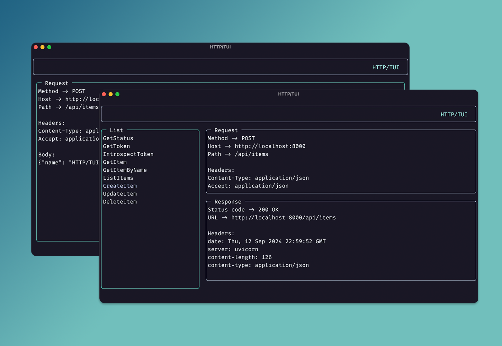

# HTTP/TUI

TUI application for storing and sending HTTP requests
without the need to leave your terminal. The interface
and input event system is built from scratch, with the
only dependencies being those related to the `requests`
package.



## Operating System Support

This application should work on the *big three*
(i.e., Linux, MacOS, Windows).

## Build Requirements
python >= v3.12.x

## Usage

### Keyboard Input

```sh
`h`         # Select section to the left
`l`         # Select section to the right
`j`         # Select/Scroll down
`k`         # Select/Scroll up
`Ctrl + q`  # Quits the application

# Only applicable to request
# and response sections.
`e`         # Expand section

# Used when not in expanded mode
`space`     # Send request
```

### Command Line Interface

```sh
usage: main.py [-h] [-t THEME] [-m MODE] [-b BORDER] [-d DIRECTORY]

Send and recieve HTTP request in the terminal

options:
  -h, --help            show this help message and exit
  -t THEME, --theme THEME
                        Path to theme file (defaults to 'theme.ini')
  -m MODE, --mode MODE  Color style: '4bit', '8bit', or '24bit' (defaults to '24bit')
  -b BORDER, --border BORDER
                        Border style: 'single' or 'double' (defaults to 'single')
  -d DIRECTORY, --directory DIRECTORY
                        Path to requests directory (defaults to script directory)
```

### Bash/Powershell

It is recommended that you create a function in your `.rc` / `$PROFILE` config. as seen below:

`bashrc`

```sh
httptui() { python3 <PATH-TO-PROJECT>/main.py "$@" ;}
```

Powershell `$PROFILE`

```ps1
function httptui() { python <PATH-TO-PROJECT>\main.py @args}
```

## File Format

This application follows a `.http` file format almost the same
as the one described in the following
[Microsoft Documentation](https://learn.microsoft.com/en-us/aspnet/core/test/http-files?view=aspnetcore-8.0)

Note that there are some differences, with them primary 
one being that this application supports the ability to
assign a name to a given request (for display in the UI)
using the `&` character.

```sh
[HTTP Method] [URL] [HTTP Version]
[Header Key]: [Header Value]
...

[Request Body]
```

Use the following conventions within the `.http` file
```sh
# or //  For Comments
&        For request name

$env.<VARIABLE>$ For environment variable

@name=value   For variable definition
{{name}}      For variable usage

@postscript   For script to run after specific request
```

>[!NOTE]
>Variables must be defined before a request
>and names (optional) must be defined before
> a request, but after variables.

>[!NOTE]
>Also note that environment variables will be
>loaded just before a request is sent.

### Postscript

When using `postscript` the expected value is a path to a python script
that should be executed following the associated request. The second argument
of `sys.argv` passed to the `postscript` is the `requests.Response` object
from the sent request. The primary usecase for this capability is to
use information received in the response, to set environment variables
that can be used in another request, since environment variables are loaded
at *runtime*.

See the `postscript.py` file as an example.

## HTTP Methods

This application supports sending the following types of requests:
- GET
- PUT 
- POST 
- HEAD 
- PATCH 
- DELETE 
- OPTIONS

And the following body request body types:
- text/plain
- application/json
- multipart/form-data
- application/x-www-form-urlencoded

>[!NOTE]
> When using the multipart/form-data body type, this
> application currently does not support sending files.
> Support for this can easily be added in the future.
